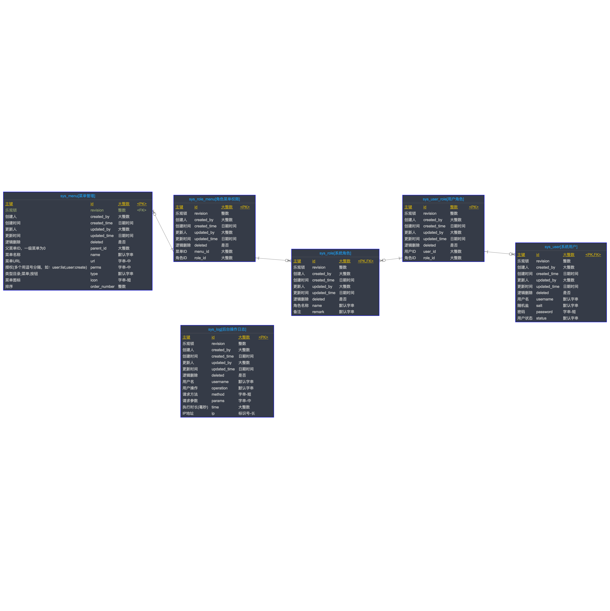

## 
目录

 - ### 1. 模块清单
- [<h4 id="module-manage-from">1.1. 后台模块</h4>](#module-manage "manage")
	- [<h5 id="module-manage-relation}-from">1.1.1. 关联关系</h5>](#module-manage-relation "关联关系")
	- [<h5 id="module-manage-tableList-from">1.1.2. 表清单</h5>](#module-manage-tableList "表清单")
	- [<h5 id="module-manage-tableColumnList-from">1.1.3. 表列清单</h5>](#module-manage-tableColumnList "表列清单")
		- [<h6 id="module-manage-tableColumnList-sys_menu-from">1.1.3.1 sys\_menu【菜单管理】</h6>](#module-manage-tableColumnList-sys_menu "sys_menu")
		- [<h6 id="module-manage-tableColumnList-sys_role-from">1.1.3.2 sys\_role【系统角色】</h6>](#module-manage-tableColumnList-sys_role "sys_role")
		- [<h6 id="module-manage-tableColumnList-sys_role_menu-from">1.1.3.3 sys\_role\_menu【角色菜单权限】</h6>](#module-manage-tableColumnList-sys_role_menu "sys_role_menu")
		- [<h6 id="module-manage-tableColumnList-sys_user-from">1.1.3.4 sys\_user【系统用户】</h6>](#module-manage-tableColumnList-sys_user "sys_user")
		- [<h6 id="module-manage-tableColumnList-sys_user_role-from">1.1.3.5 sys\_user\_role【用户角色】</h6>](#module-manage-tableColumnList-sys_user_role "sys_user_role")
		- [<h6 id="module-manage-tableColumnList-sys_log-from">1.1.3.6 sys\_log【后台操作日志】</h6>](#module-manage-tableColumnList-sys_log "sys_log")
- [<h4 id="module-backlog-from">1.2. 需求模块</h4>](#module-backlog "backlog")
	- [<h5 id="module-backlog-relation}-from">1.2.1. 关联关系</h5>](#module-backlog-relation "关联关系")
	- [<h5 id="module-backlog-tableList-from">1.2.2. 表清单</h5>](#module-backlog-tableList "表清单")
	- [<h5 id="module-backlog-tableColumnList-from">1.2.3. 表列清单</h5>](#module-backlog-tableColumnList "表列清单")
		- [<h6 id="module-backlog-tableColumnList-t_user-from">1.2.3.1 t\_user【用户】</h6>](#module-backlog-tableColumnList-t_user "t_user")
		- [<h6 id="module-backlog-tableColumnList-t_project-from">1.2.3.2 t\_project【项目】</h6>](#module-backlog-tableColumnList-t_project "t_project")
		- [<h6 id="module-backlog-tableColumnList-t_project_backlog-from">1.2.3.3 t\_project\_backlog【backlog】</h6>](#module-backlog-tableColumnList-t_project_backlog "t_project_backlog")
		- [<h6 id="module-backlog-tableColumnList-t_project_module-from">1.2.3.4 t\_project\_module【功能模块】</h6>](#module-backlog-tableColumnList-t_project_module "t_project_module")
		- [<h6 id="module-backlog-tableColumnList-t_project_user-from">1.2.3.5 t\_project\_user【项目人员】</h6>](#module-backlog-tableColumnList-t_project_user "t_project_user")
  ---

### 1. 模块清单
 - [<h4 id="module-manage">1.1. 后台模块</h4>](#module-manage-from)
 - [<h5 id="module-manage-relation">1.1.1 关联关系</h5>](#module-manage-relation-from)
 ---

 ---

 - [<h5 id="module-manage-tableList">1.1.2 表清单</h5>](#module-manage-tableList-from)

 ---

| 名称 | 代码 | 备注 |
| ------------ | ------------ | ------------ |
| 菜单管理 | sys\_menu |  |
| 系统角色 | sys\_role |  |
| 角色菜单权限 | sys\_role\_menu |  |
| 系统用户 | sys\_user |  |
| 用户角色 | sys\_user\_role |  |
| 后台操作日志 | sys\_log |  |

 ---

 - [<h5 id="module-manage-tableColumnList">1.1.3 表列清单</h5>](#module-manage-tableColumnList-from)

 ---

 - [<h6 id="module-manage-tableColumnList-sys_menu">sys_menu【菜单管理】</h6>](#module-manage-tableColumnList-sys_menu-from)

| 代码 | 名称 | 数据类型(MYSQL) | 主键 | 备注 |
| ------------ | ------------ | ------------ | ------------ | ------------ |
| id | 主键 | BIGINT | √ |  |
| revision | 乐观锁 | INT |  |  |
| created\_by | 创建人 | BIGINT |  |  |
| created\_time | 创建时间 | DATETIME |  |  |
| updated\_by | 更新人 | BIGINT |  |  |
| updated\_time | 更新时间 | DATETIME |  |  |
| deleted | 逻辑删除 | VARCHAR(1) |  |  |
| parent\_id | 父菜单ID，一级菜单为0 | BIGINT |  |  |
| name | 菜单名称 | VARCHAR(32) |  |  |
| url | 菜单URL | VARCHAR(1024) |  |  |
| perms | 授权(多个用逗号分隔，如：user:list,user:create) | VARCHAR(1024) |  |  |
| type | 类型目录;菜单;按钮 | VARCHAR(32) |  |  |
| icon | 菜单图标 | VARCHAR(128) |  |  |
| order\_number | 排序 | INT |  |  |

 ---

 - [<h6 id="module-manage-tableColumnList-sys_role">sys_role【系统角色】</h6>](#module-manage-tableColumnList-sys_role-from)

| 代码 | 名称 | 数据类型(MYSQL) | 主键 | 备注 |
| ------------ | ------------ | ------------ | ------------ | ------------ |
| id | 主键 | BIGINT | √ |  |
| revision | 乐观锁 | INT |  |  |
| created\_by | 创建人 | BIGINT |  |  |
| created\_time | 创建时间 | DATETIME |  |  |
| updated\_by | 更新人 | BIGINT |  |  |
| updated\_time | 更新时间 | DATETIME |  |  |
| deleted | 逻辑删除 | VARCHAR(1) |  |  |
| name | 角色名称 | VARCHAR(32) |  |  |
| remark | 备注 | VARCHAR(32) |  |  |

 ---

 - [<h6 id="module-manage-tableColumnList-sys_role_menu">sys_role_menu【角色菜单权限】</h6>](#module-manage-tableColumnList-sys_role_menu-from)

| 代码 | 名称 | 数据类型(MYSQL) | 主键 | 备注 |
| ------------ | ------------ | ------------ | ------------ | ------------ |
| id | 主键 | BIGINT | √ |  |
| revision | 乐观锁 | INT |  |  |
| created\_by | 创建人 | BIGINT |  |  |
| created\_time | 创建时间 | DATETIME |  |  |
| updated\_by | 更新人 | BIGINT |  |  |
| updated\_time | 更新时间 | DATETIME |  |  |
| deleted | 逻辑删除 | VARCHAR(1) |  |  |
| menu\_id | 菜单ID | BIGINT |  |  |
| role\_id | 角色ID | BIGINT |  |  |

 ---

 - [<h6 id="module-manage-tableColumnList-sys_user">sys_user【系统用户】</h6>](#module-manage-tableColumnList-sys_user-from)

| 代码 | 名称 | 数据类型(MYSQL) | 主键 | 备注 |
| ------------ | ------------ | ------------ | ------------ | ------------ |
| id | 主键 | BIGINT | √ |  |
| revision | 乐观锁 | INT |  |  |
| created\_by | 创建人 | BIGINT |  |  |
| created\_time | 创建时间 | DATETIME |  |  |
| updated\_by | 更新人 | BIGINT |  |  |
| updated\_time | 更新时间 | DATETIME |  |  |
| deleted | 逻辑删除 | VARCHAR(1) |  |  |
| username | 用户名 | VARCHAR(32) |  |  |
| salt | 随机盐 | VARCHAR(32) |  |  |
| password | 密码 | VARCHAR(128) |  |  |
| status | 用户状态 | VARCHAR(32) |  |  |

 ---

 - [<h6 id="module-manage-tableColumnList-sys_user_role">sys_user_role【用户角色】</h6>](#module-manage-tableColumnList-sys_user_role-from)

| 代码 | 名称 | 数据类型(MYSQL) | 主键 | 备注 |
| ------------ | ------------ | ------------ | ------------ | ------------ |
| id | 主键 | INT | √ |  |
| revision | 乐观锁 | INT |  |  |
| created\_by | 创建人 | BIGINT |  |  |
| created\_time | 创建时间 | DATETIME |  |  |
| updated\_by | 更新人 | BIGINT |  |  |
| updated\_time | 更新时间 | DATETIME |  |  |
| deleted | 逻辑删除 | VARCHAR(1) |  |  |
| user\_id | 用户ID | BIGINT |  |  |
| role\_id | 角色ID | BIGINT |  |  |

 ---

 - [<h6 id="module-manage-tableColumnList-sys_log">sys_log【后台操作日志】</h6>](#module-manage-tableColumnList-sys_log-from)

| 代码 | 名称 | 数据类型(MYSQL) | 主键 | 备注 |
| ------------ | ------------ | ------------ | ------------ | ------------ |
| id | 主键 | BIGINT | √ |  |
| revision | 乐观锁 | INT |  |  |
| created\_by | 创建人 | BIGINT |  |  |
| created\_time | 创建时间 | DATETIME |  |  |
| updated\_by | 更新人 | BIGINT |  |  |
| updated\_time | 更新时间 | DATETIME |  |  |
| deleted | 逻辑删除 | VARCHAR(1) |  |  |
| username | 用户名 | VARCHAR(32) |  |  |
| operation | 用户操作 | VARCHAR(32) |  |  |
| method | 请求方法 | VARCHAR(128) |  |  |
| params | 请求参数 | VARCHAR(1024) |  |  |
| time | 执行时长(毫秒) | BIGINT |  |  |
| ip | IP地址 | VARCHAR(64) |  |  |

 ---

 - [<h4 id="module-backlog">1.2. 需求模块</h4>](#module-backlog-from)
 - [<h5 id="module-backlog-relation">1.2.1 关联关系</h5>](#module-backlog-relation-from)
 ---

 ---

 - [<h5 id="module-backlog-tableList">1.2.2 表清单</h5>](#module-backlog-tableList-from)

 ---

| 名称 | 代码 | 备注 |
| ------------ | ------------ | ------------ |
| 用户 | t\_user |  |
| 项目 | t\_project |  |
| backlog | t\_project\_backlog |  |
| 功能模块 | t\_project\_module |  |
| 项目人员 | t\_project\_user |  |

 ---

 - [<h5 id="module-backlog-tableColumnList">1.2.3 表列清单</h5>](#module-backlog-tableColumnList-from)

 ---

 - [<h6 id="module-backlog-tableColumnList-t_user">t_user【用户】</h6>](#module-backlog-tableColumnList-t_user-from)

| 代码 | 名称 | 数据类型(MYSQL) | 主键 | 备注 |
| ------------ | ------------ | ------------ | ------------ | ------------ |
| id | 主键 | BIGINT | √ |  |
| revision | 乐观锁 | INT |  |  |
| created\_by | 创建人 | BIGINT |  |  |
| created\_time | 创建时间 | DATETIME |  |  |
| updated\_by | 更新人 | BIGINT |  |  |
| updated\_time | 更新时间 | DATETIME |  |  |
| deleted | 逻辑删除 | VARCHAR(1) |  |  |
| open\_id | 微信Open ID | VARCHAR(64) |  |  |
| nickname | 微信昵称 | VARCHAR(64) |  |  |
| head\_image\_url | 微信头像 | VARCHAR(128) |  |  |
| phone | 手机号码 | VARCHAR(32) |  |  |

 ---

 - [<h6 id="module-backlog-tableColumnList-t_project">t_project【项目】</h6>](#module-backlog-tableColumnList-t_project-from)

| 代码 | 名称 | 数据类型(MYSQL) | 主键 | 备注 |
| ------------ | ------------ | ------------ | ------------ | ------------ |
| id | 主键 | BIGINT | √ |  |
| revision | 乐观锁 | INT |  |  |
| created\_by | 创建人 | BIGINT |  |  |
| created\_time | 创建时间 | DATETIME |  |  |
| updated\_by | 更新人 | BIGINT |  |  |
| updated\_time | 更新时间 | DATETIME |  |  |
| deleted | 逻辑删除 | VARCHAR(1) |  |  |
| name | 项目名称 | VARCHAR(128) |  |  |
| code | 项目代号 | VARCHAR(32) |  |  |
| start\_time | 开始时间 | DATETIME |  |  |
| end\_time | 结束时间 | DATETIME |  |  |
| status | 项目状态 | VARCHAR(32) |  |  |
| invite\_code | 邀请码 | VARCHAR(32) |  |  |

 ---

 - [<h6 id="module-backlog-tableColumnList-t_project_backlog">t_project_backlog【backlog】</h6>](#module-backlog-tableColumnList-t_project_backlog-from)

| 代码 | 名称 | 数据类型(MYSQL) | 主键 | 备注 |
| ------------ | ------------ | ------------ | ------------ | ------------ |
| id | 主键 | BIGINT | √ |  |
| revision | 乐观锁 | INT |  |  |
| created\_by | 创建人 | BIGINT |  |  |
| created\_time | 创建时间 | DATETIME |  |  |
| updated\_by | 更新人 | BIGINT |  |  |
| updated\_time | 更新时间 | DATETIME |  |  |
| deleted | 逻辑删除 | VARCHAR(1) |  |  |
| no | 编号 | VARCHAR(128) |  |  |
| module\_id | 功能模块 | BIGINT |  |  |
| type | 需求类型 | VARCHAR(32) |  |  |
| name | 需求名称 | VARCHAR(128) |  |  |
| user\_story | 用户故事 | VARCHAR(512) |  |  |
| priority | 优先级 | INT |  |  |
| proposer | 提出人 | VARCHAR(128) |  |  |
| proposer\_id | 提出人ID(用户ID) | BIGINT |  |  |
| propose\_time | 提出时间 | DATETIME |  |  |
| source | 需求来源 | VARCHAR(32) |  |  |
| status | 需求状态 | VARCHAR(32) |  |  |
| development\_version | 开发版本 | VARCHAR(32) |  |  |
| remark | 备注 | VARCHAR(512) |  |  |

 ---

 - [<h6 id="module-backlog-tableColumnList-t_project_module">t_project_module【功能模块】</h6>](#module-backlog-tableColumnList-t_project_module-from)

| 代码 | 名称 | 数据类型(MYSQL) | 主键 | 备注 |
| ------------ | ------------ | ------------ | ------------ | ------------ |
| id | 主键 | BIGINT | √ |  |
| revision | 乐观锁 | INT |  |  |
| created\_by | 创建人 | BIGINT |  |  |
| created\_time | 创建时间 | DATETIME |  |  |
| updated\_by | 更新人 | BIGINT |  |  |
| updated\_time | 更新时间 | DATETIME |  |  |
| deleted | 逻辑删除 | VARCHAR(1) |  |  |
| name | 名称 | VARCHAR(32) |  |  |
| parent\_id | 父菜单ID，一级菜单为0 | BIGINT |  |  |
| order\_number | 排序 | VARCHAR(32) |  |  |
| project\_id | 项目ID | BIGINT |  |  |

 ---

 - [<h6 id="module-backlog-tableColumnList-t_project_user">t_project_user【项目人员】</h6>](#module-backlog-tableColumnList-t_project_user-from)

| 代码 | 名称 | 数据类型(MYSQL) | 主键 | 备注 |
| ------------ | ------------ | ------------ | ------------ | ------------ |
| id | 主键 | BIGINT | √ |  |
| revision | 乐观锁 | INT |  |  |
| created\_by | 创建人 | BIGINT |  |  |
| created\_time | 创建时间 | DATETIME |  |  |
| updated\_by | 更新人 | BIGINT |  |  |
| updated\_time | 更新时间 | DATETIME |  |  |
| deleted | 逻辑删除 | VARCHAR(1) |  |  |
| user\_id | 用户ID | BIGINT |  |  |
| project\_id | 项目ID | BIGINT |  |  |
| role\_type | 角色类型:创建者;管理者;用户; | VARCHAR(32) |  |  |

 ---

